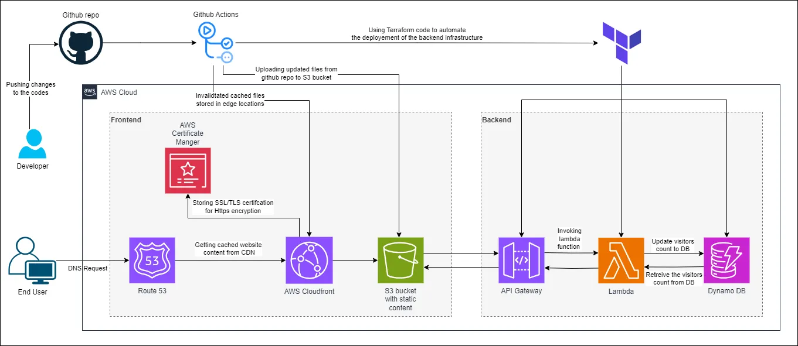

# Cloud resume challenge project

## About Project
- This project was inspired by the famous cloud resume challenge.The challenge aids in provivding hands on skills that are relevant in the real world Request for Proposal (RFP) for a cloud-native resume hosting platform.

- It is designed to be secure, scalable, and globally accessible using AWS services and infrastructure as code.

- It also demonstrates full-stack cloud architecture skills including frontend hosting, backend API integration, CI/CD automation, and security hardening.

- It is aligned with the AWS Well-Architected Framework to ensure operational excellence and reliability.

## RFP Simulation
- Client Name: CloudHire Solutions
- Project Title: Cloud-Native Resume Hosting Platform
  
Objectives:

- Host resume website entirely on AWS using serverless and managed services
- Ensure global availability with HTTPS and low latency
- Custom domain name with route 53 DNS
- Track visitor count via backend API and store in a database
- Manage infrastructure with Terraform
- Automate deployments using GitHub Actions
-  Secure backend resources from public exposure
## Project Architecture Diagram

  
## Deliverables:

- Static website hosted on S3 and served via CloudFront
- Custom domain name with route 53 DNS
- Lambda + API Gateway backend with DynamoDB integration
- Terraform codebase for infrastructure
- CI/CD workflows via GitHub Actions
- Documentation and architecture diagram
- Architecture & AWS Services Used
- Cloud Resume Architecture Diagram
- Amazon S3: Hosts the static HTML/CSS resume website
- Amazon CloudFront: Distributes content globally with HTTPS and caching
- Origin Access Control (OAC): Restricts S3 access to CloudFront only
- Custom domain name with route 53 DNS
- AWS Lambda: Handles backend logic for visitor tracking
- Amazon API Gateway: Exposes the Lambda function securely as a HTTP API
- Amazon DynamoDB: Stores visitor count data in a scalable NoSQL table
- AWS IAM: Manages least-privilege access for Lambda and API Gateway
- Terraform: Defines and manages all infrastructure as code
- GitHub Actions: Automates deployment of both frontend and backend

## Brief Explanation of Work Done

- Created a static HTML/CSS resume and hosted it on an S3 bucket
- Configured CloudFront with OAC to serve the site securely and globally
- Built a Lambda function to increment and retrieve visitor count
- Connected Lambda to API Gateway and stored data in DynamoDB
- Wrote Terraform modules to define and import existing AWS resources
- Set up GitHub Actions workflows to automate deployment on code push
- Hardened security by disabling public access to S3 and using IAM roles
- Hardened security by use of CORS for the API
- Validated the architecture against AWS best practices

## Challenges

- Unable to register a custom domain due to AWS policy on new aws accounts
- Debugging and correcting CORS errors when linking backend to front end
- Getting the website visitor counter on the front working correctingly
- Importing manually created AWS resources into Terraform without triggering destructive changes
- Managing Terraform lifecycle rules like prevent_destroy to protect critical resources
- Debugging GitHub Actions workflows and ensuring environment consistency
- Ensuring idempotency and avoiding drift between Terraform state and AWS console
- Balancing simplicity and cost with scalability and security in a personal project

## Business Value

- Demonstrates ability to design and deploy secure, scalable cloud-native applications
- Reduces operational overhead through serverless architecture and automation
- Aligns with DevOps principles by integrating CI/CD and infrastructure as code
- Enhances global availability and performance using CloudFront
- Provides a real-world example of applying the AWS Well-Architected Framework
- Serves as a reusable template for future client-facing static sites or microsites
- Builds trust with stakeholders by showing attention to security and maintainability

## Possible Improvements

- Integrate a custom domain via Route 53 and ACM for branded HTTPS access
- Add CloudFront cache invalidation on frontend deploys for faster updates
- Implement CloudWatch monitoring and alerts for backend Lambda/API usage
- Add frontend analytics using Amazon Pinpoint or Google Analytics
- Set up backend and front end to store current state inorder to allow for automated deployment that is in sync with existing state of resources
- Add unit tests and Terraform validation steps to CI/CD workflows

Link to website: https://d33f4aez18rdui.cloudfront.net/index.html (website is currently down since I brought down AWS resources but will be back up soon)

